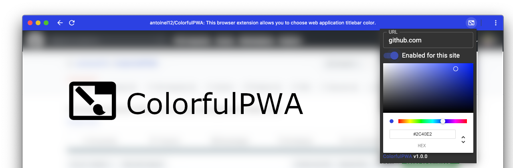

# ColorfulPWA
ColorfulPWA is a Chromium based browser extension that let you choose title bar color.

***This extension requires that you create shortcut as an app (in single window) for the website you are intending to change the color.*** 
See https://support.google.com/chrome_webstore/answer/3060053?hl=en for more details.

It is especially useful web the web developper did not specified the color for his website and when the color inferred by Chrome is ugly.

You can also use it to easily distinguish windows when you have lots of them opened or when you want to quickly discriminate the current environment (DEV, TEST or PRODUCTION) you are working on.

No data is sent to a webserver, all informations are stored locally on your device.

## Install

## Build
Restore packages 
> `npm i`

Compile for development (once)
> `npm run dev`

Compile for development (watch)
> `npm run watch`

Compile for production (once)
> `npm run build`

## Licence
This project is licensed under the AGPL-3.0 License - see the LICENSE.md file for details

## Thanks
- [martellaj for his TypeScript Chrome extension boilerplate](https://github.com/martellaj/chrome-extension-react-typescript-boilerplate)